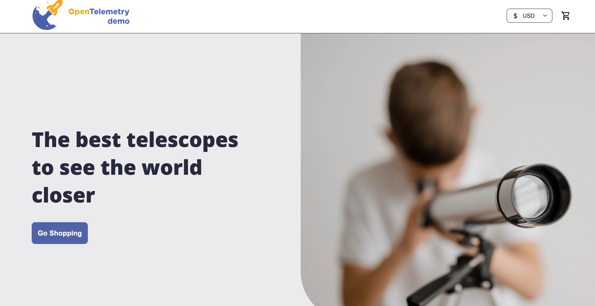

# End to End DevOps Implementation - E-Commerce Project

This is an end-to-end DevOps implementation on a real-time e-commerce project. This project involves setting up CI/CD pipelines and automating infrastructure to monitoring, security, and scaling, for e-commerce platform.


*Image Credit: freepik.com*

On a high level, this project consists of the following steps for Deployment of a real-time multi microservice architectured E-commerce application.

    1. Project Introduction
    2. Project Overview
    3. Installations and Prerequisites
    4. Run the project locally using Docker Compose
    5. Containerization of the project using Docker
    6. Build and Re-Run the Docker containers using Docker Compose
    7. Docker vs Kubernetes (K8S) & Docker Compose vs Kubernetes (K8S)
    8. Infrastructure as Code (IAC) using Terraform for Implementation of VPC & EKS in AWS
    9. Deploying & Running the Project on Kubernetes
    10. Custom Domain Configuration for the Project
    11. CI/CD Pipelines Implementation
    12. CI Pipeline Implementation with GitHub Actions
    13. CD Pipeline Implementation with GitOps using ArgoCD
    14. Project Summary

## Repository Structure
```
End-To-End-DevOps-Implementation/
│
├── demo-project-files/                 # Files related to the OpenTelemetry Demo project
│   ├── .github/workflows               # Files related to CI Pipeline
│   ├── kubernetes                      # Deploy and Service yaml files for all microservices
│   ├── src                             # Code files of all microservices related to the OpenTelemetry Demo project
│   └── other files                     # All the other files related to the OpenTelemetry Demo project
│
├── eks-install/                        # Files to provision infrastructure on AWS (VPC, EKS)
│
├── Images/                             # Images related to the project
│
├── k8s-manifests/                      # Deploy and Service yaml files for all microservices (same as demo-project-files/kubernetes)
│
└── README.md                           # Project overview and instructions
```

## 1. Project Introduction: Real-World DevOps with a Multi-Microservice E-Commerce Project

This project deals with real-time DevOps implementation using a highly popular E-Commerce demo project open-sourced by OpenTelemetry. It follows a multi-microservice architecture, where each microservice is developed in different programming languages.

This project consists of:

 - Cloud Infrastructure Setup – Learning how to configure and deploy a cloud environment for DevOps implementation.
 - Understanding the Project & SDLC – Gaining in-depth knowledge of software development lifecycles in microservices-based architectures.
 - Containerization with Docker – Learning how to package and manage applications efficiently using Docker.
 - Docker Compose Setup – Managing multi-container applications with Docker Compose.
 - Kubernetes for Orchestration – Deploying and managing containers at scale using Kubernetes.
 - Infrastructure as Code (IaC) with Terraform – Automating and managing cloud infrastructure effortlessly.

## 2. Project Overview

A detailed documentation along with architecture diagram of the project is shared in the below link.
```
https://opentelemetry.io/docs/demo/

```

*Image Credit: opentelemetry.io*

This project consists of the following 20+ microservices:
 - accounting
 - ad
 - cart
 - checkout
 - currency
 - email
 - flagd-ui
 - flagd
 - fraud-detection
 - frontend-proxy
 - frontend
 - grafana
 - image-provider
 - kafka
 - load-generator
 - otel-collector
 - payment
 - product-catalog
 - prometheus
 - quote
 - react-native-app
 - recommendation
 - shipping


*Image Credit: medium.com*

## 3. Installations and Prerequisites


*Image Credit: blurify.com*

### **EC2 Instance in AWS / Windows Subsystem for Linux (WSL) in Local**

### EC2 Instance Setup in AWS

**Step 1:** Log in to AWS Console
**Step 2:** Launch a New EC2 Instance
**Step 3:** Choose an Amazon Machine Image (AMI)
**Step 4:** Choose an Instance Type
 - **t3.xlarge+** (For heavier workloads)
**Step 5:** Configure Instance Details
- Keep the default **VPC & Subnet** (unless customizing networking)
- Enable **Auto-assign Public IP** (for internet access)
**Step 6:** Add Storage
- Default storage: 8GB but will have to change that to 30 GB as a lot of container images related to the project will be downloaded.
**Step 7:** Configure Security Group
- Create a new security group or use an existing one
- Allow **SSH (port 22)** for Linux instances
**Step 8:** Generate or Select a Key Pair
- Select **Create a new key pair**
- Choose **RSA** format and download the `.pem` file and store key securely in order to access instance
**Step 9:** Connect to EC2 Instance

#### **For Linux Instances on EC2:**
- Use SSH from terminal:
```
ssh -i /path/to/your-key.pem ec2-user@your-instance-public-ip
```


*Image Credit: medium.com*

#### **Windows Subsystem for Linux (WSL) Setup in Local**

**Step 1:** Run Command Prompt as Administrator
**Step 2:** Run the below command to install WSL
```
wsl --install
```
**Step 3:** Open WSL and create new user and password
**Step 4:** Run the below commands to update and upgrade apt packages 
```
sudo apt update
sudo apt upgrade
```
**Step 5:** Run the below commands to switch between users
```
sudo su
sudo su - <username>
``` 
### VS Code & Plugins Installation

Install VS Code in local and also install the following extensions/plugins in VS Code:
 - Docker (by Microsoft)
 - Terraform (by HashiCorp)
 - Kubernetes (by Microsoft)
 - YAML (by Red Hat)
 - WSL (by Microsoft)
 - GitHub Copilot (by GitHub)
 - GitHub Actions (by GitHub)

### Docker Installation and Configuration

#### Add Docker's official GPG key:
```
sudo apt-get update
sudo apt-get install ca-certificates curl
sudo install -m 0755 -d /etc/apt/keyrings
sudo curl -fsSL https://download.docker.com/linux/ubuntu/gpg -o /etc/apt/keyrings/docker.asc
sudo chmod a+r /etc/apt/keyrings/docker.asc
```

#### Add the repository to Apt sources:
```
echo \
  "deb [arch=$(dpkg --print-architecture) signed-by=/etc/apt/keyrings/docker.asc] https://download.docker.com/linux/ubuntu \
  $(. /etc/os-release && echo "${UBUNTU_CODENAME:-$VERSION_CODENAME}") stable" | \
  sudo tee /etc/apt/sources.list.d/docker.list > /dev/null
sudo apt-get update
```

#### Install Docker
```
sudo apt-get install docker-ce docker-ce-cli containerd.io docker-buildx-plugin docker-compose-plugin
```

#### Verify Docker Installation
```
sudo docker run hello-world
```

Note: To install Docker on distributions of linux or other operating systems like Windows, Install Docker Desktop first.

### Kubectl Installation and Configuration

#### Download kubectl
```
sudo curl -LO "https://dl.k8s.io/release/$(curl -L -s https://dl.k8s.io/release/stable.txt)/bin/linux/amd64/kubectl"
```

#### Install Kubectl
```
sudo install -o root -g root -m 0755 kubectl /usr/local/bin/kubectl
```

#### Verify Kubectl
```
kubectl version --client
```

### Terraform Installation and Configuration

#### Add Hashicorp repos
```
sudo apt-get update && sudo apt-get install -y gnupg software-properties-common

wget -O- https://apt.releases.hashicorp.com/gpg | \
gpg --dearmor | \
sudo tee /usr/share/keyrings/hashicorp-archive-keyring.gpg > /dev/null

echo "deb [signed-by=/usr/share/keyrings/hashicorp-archive-keyring.gpg] \
https://apt.releases.hashicorp.com $(lsb_release -cs) main" | \
sudo tee /etc/apt/sources.list.d/hashicorp.list

sudo apt update
```

#### Install Terraform
```
sudo apt-get install terraform
```

#### Verify Terraform Installation
```
terraform -help
```

## 4. Run the project locally using Docker Compose


*Image Credit: docker.com*


### Verify Docker Compose Installation
```
docker compose -h
```

### Verify Git Installation
```
git --version
```

### Clone Git repository (iam-veeramalla/ultimate-devops-project-demo - forked from open-telemetry/opentelemetry-demo)
```
git clone https://github.com/iam-veeramalla/ultimate-devops-project-demo.git
```

```
cd ultimate-devops-project-demo/
```

```
ls
ls -ltr
```

### Open Docker Compose file
```
vim docker-compose.yml
```
### Modes in VI Editor
- **Normal Mode** (default) – Used for navigation and command execution.
- **Insert Mode** – Used for text editing (press `i` to enter, `Esc` to exit).
- **Command Mode** – Used for saving (:w!), quitting (:q!), and save and quit (:wq!) (press `:` in Normal mode).

### For EC2 Instance (Check memory and increase partition size)

Check volume size of /dev/root 
```
df -h
```

Change Volume size on EC2 Instance then run the below to check volume size of blocks
```
lsblk
```

Install cloud-guest-utils
```
sudo apt install cloud-guest-utils
```

Increase partition of xvda
```
sudo growpart /dev/xvda 1
```

Check volume size of blocks again
```
lsblk
```

Increase partition of /dev/root
```
sudo resize2fs /dev/xvda1
```

Check volume size of /dev/root again
```
df -h
```

### For Windows Subsystem for Linux (WSL) in Local (Change directory Local)
If there is not enough space in C drive then change path to proposed drive then change location in Docker Desktop in Settings > Resources > Disk image location
to E:\docker-data

Update command as per requirements.
```
cd /mnt/e/your-path
```

### Run Docker Compose
```
docker compose up -d
```

### For Docker Containers Status
```
docker ps
```

### View Deployed Website (For WSL)
```
http://localhost:8080
```

### View Deployed Website (For EC2 Instance)
```
http://public-IP-of-EC2:8080
```
Note: Before that project needs to be exposed on EC2 Instance by adding a new Inbound Rule (All Traffic/Custom - 8080 - IPv4)

## 5. Containerization of the project using Docker

### Docker Lifecycle

 - **Dockerfile Creation** - The Dockerfile ensures consistency by automating the image creation process.
 - **Docker Image Build** - Using the Dockerfile, a Docker image is created by `docker build`. It is standalone package with app, tools, libraries, and dependencies.
 - **Run the Docker Container** - Using the Image, a Docker container is created and executed using  `docker run`. It is isolated app environment enabling consistent, fast, lightweight deployments.

Now containerize the following microservices:
 - Product Catalog - Go
 - Ad - Java
 - Recommendation - Python 
 - Shipping - Rust

### Containerization of Product Catalog (Go based microservice)

Install go locally
```
sudo apt install golang-go
```

Run locally to test before creating Dockerfile
```
export PRODUCT_CATALOG_PORT=8088
```

Remove existing Dockerfile from product catalog folder and create a new Dockerfile from scratch
```
rm -rf Dockerfile
```

**First** Create Dockerfile
```
vim Dockerfile
```

Fill the empty Dockerfile with the below Multi-Stage Dockerfile contents 
```
FROM golang:1.22-alpine AS builder

WORKDIR /usr/src/app

COPY . .

RUN go mod download
RUN go build -o product-catalog ./


FROM alpine AS release

WORKDIR /usr/src/app

COPY ./products ./products
COPY --from=builder /usr/src/app/product-catalog ./

ENV PRODUCT_CATALOG_PORT=8088
ENTRYPOINT ["./product-catalog"]
```

**Second** Build Docker Image
```
docker build -t <docker username>/product-catalog:v1 .
```

Verify if the image is built
```
docker images | grep <docker username>
```

**Third** Run Docker Container
```
docker run <docker username>/product-catalog:v1
```

Verify the container status and delete container
```
docker ps -a
```

```
docker rm <container_id>
```

Note: When this service is run the output should be similar to the one mentioned in the README file of Product Catalog

### Containerization of Ad (Java based microservice)

Install java locally
```
sudo apt install openjdk-21-jre-headless
```

For permissions, if not available already 
```
chmod +x ./gradlew
```

Run locally to test before creating Dockerfile
```
./gradlew installDist
```

```
export AD_PORT=9099
./build/install/opentelemetry-demo-ad/bin/Ad
```

Remove existing Dockerfile from ad folder and create a new Dockerfile from scratch
```
rm -rf Dockerfile
```

**First** Create Dockerfile
```
vim Dockerfile
```

Fill the empty Dockerfile with the below Multi-Stage Dockerfile contents 
```
FROM eclipse-temurin:21-jdk AS builder

WORKDIR /usr/src/app/

COPY gradlew* settings.gradle* build.gradle .
COPY ./gradle ./gradle

RUN chmod +x ./gradlew
RUN ./gradlew
RUN ./gradlew downloadRepos

COPY . .
COPY ./pb ./proto

RUN chmod +x ./gradlew
RUN ./gradlew installDist -PprotoSourceDir=./proto

#####################################################

FROM eclipse-temurin:21-jre

WORKDIR /usr/src/app

COPY --from=builder /usr/src/app/ ./

ENV AD_PORT=9099
ENTRYPOINT ["./build/install/opentelemetry-demo-ad/bin/Ad"]
```

**Second** Build Docker Image
```
docker build -t <docker username>/adservice:v1 .
```

Verify if the image is built
```
docker images | grep <docker username>
```

**Third** Run Docker Container
```
docker run <docker username>/adservice:v1
```

Verify the container status and delete container
```
docker ps -a
```

```
docker rm <container_id>
```

Note: When this service is run the output should be similar to the one mentioned in the README file of Ad

### Containerization of Recommendation (Python based microservice)

For this microservice, a proper readme file which displays instructions to run locally is not available.

Remove existing Dockerfile from recommendation folder and create a new Dockerfile from scratch
```
rm -rf Dockerfile
```

**First** Create Dockerfile
```
vim Dockerfile
```

Fill the empty Dockerfile with the below Dockerfile contents 
```
FROM python:3.12-slim-bookworm AS base

WORKDIR /usr/src/app

COPY requirements.txt ./

RUN pip install --upgrade pip
RUN pip install -r requirements.txt

COPY . .

ENV AD_PORT=9099
ENTRYPOINT ["python", "recommendation_server.py"]
```

**Second** Build Docker Image
```
docker build -t <docker username>/recommendation:v1 .
```

Verify if the image is built
```
docker images | grep <docker username>
```

**Third** Run Docker Container
```
docker run <docker username>/recommendation:v1
```

Verify the container status and delete container
```
docker ps -a
```

```
docker rm <container_id>
```

Note: When this service is run the output should be similar to the one mentioned in the README file of Recommendation

### Containerization of Shipping Catalog (Rust based microservice)

Install go locally
```
sudo curl --proto '=https' --tlsv1.2 -sSf https://sh.rustup.rs | sh
```

For this microservice, Docker init will be used to create docker file

**First** Create Dockerfile
```
docker init
```
Select the following options when options appear after running `docker init`
  - Click `yes` to overwrite old Dockerfile
  - Select the programming language as `Rust`
  - Type the latest/stable version `1.76.0`
  - Select default file, type port `7077`

Now open dockerfile and try to troubleshoot with the help of AI, and see if the docker image builds or not.

### Push Images to Docker Registry

Login to Docker (docker,io / quay.io / ECR), Check for images in local, and Push images from local to docker hub registry:
```
docker login docker.io
```

```
docker images | grep <docker username>
```

```
docker push <docker username/<image name>:<tag>
```

## 6. Build and Re-Run the Docker containers using Docker Compose

### Docker compose Overview

**Services** - Services define **containers** in the Docker Compose setup. Each service represents a different part of an application (e.g., database, backend, frontend). It consists of the following:
  - Image: The Docker image to use.  
  - Build: If no image exists, specify how to build it.  
  - Ports: Expose container ports.  
  - Environment: Define environment variables.  
  - Depends_on: Set service dependencies.  

**Networks** - Networks allow **containers to communicate** with each other. Containers in the same network **can talk** using service names. It consists of the following:
  - Driver: Defines the network type (e.g., bridge, overlay).  
  - Attachable: Allows external containers to join.  

**Volumes** - Volumes store **persistent data** outside the container. Even if a container stops, the data remains. It consists of the following:
- Named Volumes: Shared storage between containers.  
- Bind Mounts: Maps a host directory to a container path.  

### Docker compose in action

Use `docker compose` to run the whole project on network:

Stop all the running containers, and run all the containers:
```
docker compose down
```
```
docker compose up -d
```

Opensearch might be shown as unhealthy. In that case try the below:

Inspect logs for OpenSearch, Try restarting the container, and Recreate it cleanly:
```
docker logs opensearch
```

```
docker restart opensearch
```

```
docker-compose rm -f opensearch
docker-compose up -d opensearch
```

And Re-Run all the containers:
```
docker compose up -d
```

View Deployed Website after few minutes (For WSL)
```
http://localhost:8080
```

View Deployed Website after few minutes (For EC2 Instance)
```
http://public-IP-of-EC2:8080
```

## 7. Docker vs Kubernetes (K8S) & Docker Compose vs Kubernetes (K8S)

### Docker vs Kubernetes (K8S)

 - Docker runs containers, but they are temporary and need manual management.
 - Kubernetes is a Container Orchestration Platform which automates scaling, healing, and service discovery.
 - With Kubernetes, applications are more reliable, scalable, and self-healing.

### Docker Compose vs Kubernetes (K8S)

 - **Docker Compose** is ideal for simple, single-host applications which allows to define and run multi-container applications with a single `docker-compose.yml` file, and is best suited for development environments and smaller-scale use cases.
 - **Kubernetes** is designed for complex, multi-host environments and large-scale applications. It automates the deployment, scaling, and management of containers across a cluster of machines.

## 8. Infrastructure as Code (IAC) using Terraform for Implementation of VPC & EKS in AWS


*Image Credit: medium.com*

### Terraform LifeCycle

Terraform follows a well-defined lifecycle for managing infrastructure as code.

  - Initialization (`terraform init`) - Prepares the working directory for Terraform operations, Downloads required provider plugins and modules, and Configures the backend for storing state files.

  - Planning (`terraform plan`) - Analyzes the existing state and the desired configuration, Shows a preview of what actions Terraform will take, and Helps in reviewing changes before applying them.

  - Application (`terraform apply`) - Executes the planned changes to create, update, or destroy resources, and Stores the updated state in the backend.

### Connect Terraform with AWS to Create AWS Resources

Install AWS CLI on WSL (Local) / EC2 Instance
```
sudo curl "https://awscli.amazonaws.com/awscli-exe-linux-x86_64.zip" -o "awscliv2.zip"
unzip awscliv2.zip
sudo ./aws/install
```

Verify installation
```
aws --version
```

Configure AWS CLI (Create Access Keys first -  AWS > Security Credentials > Access Keys > CLI > Create Access Keys)
```
aws configure
```

Note: Provide the details like AWS Access Key ID, AWS Secret Access Key, Default region name (e.g., us-east-1) when prompted.

### Terraform Statefile
 
Terraform statefile (`terraform.tfstate`) is used for tracking resources (to understand resources it manage), performance optimization (to query from statefile without querying from cloud provider), dependency management (to determine resource dependencies and execution order). As statefile is local and have sensitive information, so Statefile management is necessary. It can be done in two ways:
 - Remote Backend (`backend.tf` on S3 bucket)
 - State Locking (`terraform.tfstate` lock  on DynamoDB)

### Creation of S3 bucket and DynamoDB terraform file for Statefile Management

Initially create a directory named **eks-install** and create a sub-directory named **backend**. Now create `main.tf` & `outputs.tf` to write appropriate terraform codes in both of the files to create S3 bucket and DynamoDB table. Terraform documentation comes in handy in this case.

For complete Backend creation the following resource blocks are required in the terraform code:
 - S3 Bucket (for terraform state)
    - Versioning
    - Encryption
 - DynamoDB Table (for terraform locks)

In WSL/EC2 instance, Change the directory to **backend** directory inside **eks-install** directory and run the below commands:
```
terraform init
```

```
terraform plan
```

```
terraform apply
```

The created resources can be deleted using the following command, provided they are not in use, as they incur costs:
```
terraform destroy
```

### Creation of Modules (VPC & EKS)

Create a directory named **modules** inside **eks_install**. Now create two sub-directories **vpc** & **eks**, and create `main.tf`, `variables.tf` & `outputs.tf` to write appropriate terraform codes in both of the files to create VPC and EKS in the appropriate folders. Terraform documentation comes in handy in this case.

For complete VPC creation the following resource blocks are required in the terraform code:
 - VPC
    - Public Subnet
        - Internet Gateway
        - Route Table (Attach Internet Gateway to it)
        - Association of Route Table to Public Subnet
    - Private Subnet
       - NAT Gateway
       - Route Table (Attach NAT Gateway to it)
       - Association of Route Table to Private Subnet

For complete EKS creation the following resource blocks are required in the terraform code:
 - EKS
    - For Master Component (Generally Single)
        - IAM Role - Cluster (This can be done for EC2 Service/Fargate Service)
        - Create and Attach Policy
        - Create EKS Cluster (for Control Plane) 
    - For Worker Component (Generally Multiple - Depends on Auto Scaling group)
       - IAM Role - Node (This can be done for EC2 Service/Fargate Service)
       - Create and Attach Policy
       - Create Node Group (for Data Plane) and attach it to EKS Cluster of Master Component

Note: Provider configuration is not mentioned in modules as they are not used for invocation directly. The provider configuration has to be mentioned in the `main.tf` file of the **eks-install** directory for the actual execution.

For the actual execution, create  `main.tf`, `variables.tf` & `outputs.tf` files in **eks_install** to invoke both the modules from this single place.

For actual execution the following resource blocks are required in the terraform code:
```
 - Required Providers
 - Backend Configuration for S3 bucket & DynamoDB
 - Provider
    - AWS
 - Modules
    - VPC 
      - Source - Location of the VPC terraform file
      - Variables - Already defined for invocation
    - EKS
      - Source - Location of the VPC terraform file
      - Variables - Already defined for invocation
```

In WSL/EC2 instance, Change the directory to **eks-install** directory and run the below commands:
```
terraform init
```

```
terraform plan
```

```
terraform apply
```

The created resources can be deleted using the following command, provided they are not in use, as they incur costs:
```
terraform destroy
```

In case of proceeding with destroy, destroy in the following order:
 - First, Destroy with cd (current directory) as **eks-install**
 - Next, Destroy with cd (current directory) as **backend**

In case of proceeding with creation again, create in the following order:
 - First, Create (Init, Plan, Apply) with cd (current directory) as **backend**
 - Next, Create (Init, Plan, Apply) with cd (current directory) as **eks-install**

## 9. Deploying & Running the Project on Kubernetes


*Image Credit: sysxplore.com*

### Kubernetes cluster configuration

To get list of clusters:
```
kubectl config view
```

To get context of current cluster connected to Kubectl:
```
kubectl config current-context
```

To switch between clusters:
```
kubectl config use-context <cluster name>
```
In order to update `kubeconfig` file with EKS cluster information, follow the below:

**Step 1:** Download and Install AWS CLI
Follow the instructions to download and install the AWS CLI from the official AWS documentation.
```
sudo apt install unzip
```

```
sudo curl "https://awscli.amazonaws.com/awscli-exe-linux-x86_64.zip" -o "awscliv2.zip"
unzip awscliv2.zip
sudo ./aws/install
```

**Step 2:** Configure AWS CLI with credentials
```
aws configure
```
Note: Credentials can also be obtained from terminal by command"
```
vim ~/.aws/credentials
```

**Step 3:** Update kubeconfig with EKS Cluster (my-eks-cluster)

Use the following command to update kubeconfig file with the EKS cluster:
```
aws eks --region <your-region> update-kubeconfig --name <your-eks-cluster-name>
```

Replace <your-region> with the AWS region where the EKS cluster is located and <your-cluster-name> with the name of previously created EKS cluster.

**Step 4:** Verify the Configuration

Verify that kubeconfig file is correctly configured and can connect to EKS cluster by running:
```
kubectl config view
```

```
kubectl config current-context
```

```
kubectl get nodes
```

### Kubernetes Implementation Overview

For the implementation of Kubernetes, the following are required:
 - Service Account
 - Deployment Resource (`deploy.yaml`)
    - Scaling
    - Healing
 - Service Resource (`service.yaml`)
   - Service Discovery
 - Deployment of project
 - Service Types
   - ClusterIP / NodePort / LoadBalancer
 - Access project from external world using
   - Load Balancer
 - Service Types
   - Ingress & Ingress Controller
 - Access project from external world using
   - Ingress & Ingress Controller

### Service Account Creation

Just like users have user account, pods should have service account to run. Container in Docker - Pod in Kubernetes. Assignment of pod to service account is necessary to run the microservice on kubernetes. However, most of them tend to ignore it for sample/demo applications. By default, kubernetes has service account called `default`. To give permissions to service account, permissions have to be given by Role which is assigned by Role Binding/Cluster Role Binding.

### Deployment Resource

Docker containers are Ephemeral (short-lived) in nature, which results in change in IP address of containers - when container goes down and is restarted again. So, this is one of the reasons of why kubernetes is used.

- If container goes down, and does not have restart policy, then Deployment Resource - Healing is used.
- During peak times, high availability of container (using multiple copies of a single container) is required. So, Deployment Resource - Scaling is used. 
- Replica Set is a controller that helps in auto-healing & scaling in K8S.

### Service Resource

If one of the Docker containers goes down, and even if it is restarted instantly, the IP address might change. So, the other microservices wouldn't be able to discover and communicate with it. In this case service resource is used. 

 - One microservice doesn't communicate directly with other, instead a proxy (service) will mediate their communication.
 - The service doesn't use IP address to communicate, it uses labels and selectors.
 - Service is not only used for internal communication between microservices, it is also used for communication with the external world, as it provides Public URL.

### Deployment of project

Utilize the `k8s-manifests` directory or `kubernetes` folder in demo project files which have `deploy.yaml` and `svc.yaml` files for all microservices separately (or) `complete-deploy.yaml` (for complete yaml files that includes `deploy.yaml` & `svc.yaml` of all microservices) and `serviceaccount.yaml` (for service account creation) for all microservices together (split with --- symbol).

For `deploy.yaml` in yaml files, Kubernetes requires the following to understand the resources:
```
 - apiversion:
 - kind: Deployment
 - metadata:
   - name:
   - labels:
 - spec:
   - replicas: 
   - template: 
     - metadata:
       - labels: (for service discovery)
   - spec:
     - service account name:
     - containers:
      - name:
      - image:
      - ports:
      - env: (will be given by developers)
      - volumes:  
```

For `svc.yaml` in yaml files, Kubernetes requires the following to understand the resources:
```
 - apiversion:
 - kind: Service
 - metadata:
   - name:
   - labels:
 - spec:
   - type: (ClusterIP/NodePort/LoadBalancer)
   - ports: (not container port)
     - port:
     - target port:
   - selector: (label of pod resource/deployment template)
```

To deploy the project on kubernetes the following commands are used:

First check if the kubectl is connected to EKS cluster:
```
kubectl config current-context
```

To verify that there are no deployments currently:
```
kubectl get all
```

Change directory to `kubernetes` in demo project where all `deploy.yaml`, `svc.yaml`, `complete-deploy.yaml` and `serviceaccount.yaml` are available.

Now apply kubectl to create a service account and verify:
```
kubectl apply -f serviceaccount.yaml
```

```
kubectl get sa
```

Now apply kubectl for all microservices and verify if all are running or not:
```
kubectl apply -f complete-deploy.yaml
```

```
kubectl get pods
```

```
kubectl get svc
```

Please note that the service type here would be ClusterIP, so this project can't be accessed from internet yet.

### Service Types (ClusterIP / NodePort / LoadBalancer)

  - **ClusterIP** - To communicate internally inside the cluster. Service-to-Service or Pod-to-Pod Communication. Secure.
  - **NodePort** - To communicate outside the cluster within VPC or for Node's IP or Organisation. 
  - **LoadBalancer** - To communicate outside from internet. In this case API talks with CCM (Cloud Control Manager) which talks with Cloud provider to create LoadBalancer.


### Access project from external world using Load Balancer:
Change service type to **LoadBalancer** (for frontend proxy) to check if the project can be accessed from internet:
```
kubectl get svc | grep frontendproxy
```

Now copy the service name to edit service type:
```
kubectl get svc | grep frontendproxy
```

```
kubectl edit svc <service name of fronend proxy>
```

Now go to the bottom and change service type from **ClusterIP** to **LoadBalancer** and save it (:wq!), and verify after few minutes.
```
kubectl get svc <service name of fronend proxy>
```

This can be verified in AWS Management Console for the required region - EC2 > Load Balancers. Now copy their DNS name from console or External IP and port from terminal to access it from internet.
```
<External IP: Port>
```

To verify on terminal
```
kubectl get deployments
```

Cons of LoadBalancers:
 - In any LoadBalancers, like F5, Nginx etc, changes made to the Kubernetes manifests or certificates etc have to be changed manually and not in declarative manner.
 - Not cost effective.
 - CCM can only create ALB load balancer.
 - Cloud providers like Minikube, Kind (Kubernetes in Docker), K3s (Lightweight Kubernetes) does not support CCM.

### Service Types (Ingress & Ingress Controller)

Ingress resources are used - as they are declarative, cost-effective, not dependent on CCM. However, it has more Operations Overhead.

Ingress - Incoming Traffic
Egress - Outgoing Traffic

Also, for LoadBalancer, the project can be accessed with IP address. However, it should not be the case in real-time. This can be verified with the below:
```
nslookup <External IP:Port>
```

The project should be accessed only through domain name (Domain name purchasing process in section 10), which can be solved with Routing Rules. Ingress defines routing rules for incoming traffic to the clusters which are to be read by Ingress Controller (Nginx, Kong, ALB etc) to create appropriate Load Balancer (Nginx, Kong, ALB etc). Ingress, Ingress Controller, LoadBalancer are created for the microservice which has to be exposed to internet (Frontend in this case)

For ingress resource in yaml files, Kubernetes requires the following to understand the resources:
```
 - apiversion: networking.k8s.io/v1
 - kind: Ingress
 - metadata:
   - name:
   - labels:
 - spec:
   - rules: 
     - host: (domain name)
     - http:
       - paths: 
         - path: /
       - backend:
         - service:
           - name:
           - port:
```

### Access project from external world using Ingress & Ingress Controller:

#### Deploy the ALB Ingress Controller

Install **eksctl**
```
sudo
# for ARM systems, set ARCH to: `arm64`, `armv6` or `armv7`
ARCH=amd64
PLATFORM=$(uname -s)_$ARCH

curl -sLO "https://github.com/eksctl-io/eksctl/releases/latest/download/eksctl_$PLATFORM.tar.gz"

# (Optional) Verify checksum
curl -sL "https://github.com/eksctl-io/eksctl/releases/latest/download/eksctl_checksums.txt" | grep $PLATFORM | sha256sum --check

tar -xzf eksctl_$PLATFORM.tar.gz -C /tmp && rm eksctl_$PLATFORM.tar.gz

sudo mv /tmp/eksctl /usr/local/bin
```

Verify version
```
eksctl version
```

Setting-up alb add on

Setup OIDC Connector to configure IAM OIDC provider 
```
export cluster_name=<your cluster name>
```

```
oidc_id=$(aws eks describe-cluster --name $cluster_name --query "cluster.identity.oidc.issuer" --output text | cut -d '/' -f 5) 
```

Check if there is an IAM OIDC provider configured already

- aws iam list-open-id-connect-providers | grep $oidc_id | cut -d "/" -f4

If not, run the below command

```
eksctl utils associate-iam-oidc-provider --cluster $cluster_name --approve
```

Download IAM policy
```
curl -O https://raw.githubusercontent.com/kubernetes-sigs/aws-load-balancer-controller/v2.11.0/docs/install/iam_policy.json
```

Create IAM Policy
```
aws iam create-policy \
    --policy-name AWSLoadBalancerControllerIAMPolicy \
    --policy-document file://iam_policy.json
```

Create IAM Role
```
eksctl create iamserviceaccount \
  --cluster=<your cluster name> \
  --namespace=kube-system \
  --name=aws-load-balancer-controller \
  --role-name AmazonEKSLoadBalancerControllerRole \
  --attach-policy-arn=arn:aws:iam::<your aws account id>:policy/AWSLoadBalancerControllerIAMPolicy \
  --approve
```

Install Helm
```
sudo curl -fsSL -o get_helm.sh https://raw.githubusercontent.com/helm/helm/main/scripts/get-helm-3
chmod 700 get_helm.sh
./get_helm.sh
```

Deploy ALB controller by adding helm repo
```
helm repo add eks https://aws.github.io/eks-charts
```

Update the repo
```
helm repo update eks
```

Install
```
helm install aws-load-balancer-controller eks/aws-load-balancer-controller \            
  -n kube-system \
  --set clusterName=<your cluster name> \
  --set serviceAccount.create=false \
  --set serviceAccount.name=aws-load-balancer-controller \
  --set region=<region> \
  --set vpcId=<your vpc id>
```

Verify that the deployments are running.
```
kubectl get deployment -n kube-system aws-load-balancer-controller
```

#### Setup Ingress Resources and Access the project

To get service name of fronend proxy
```
kubectl get svc | grep frontendproxy
```

Edit service type to Nodeport
```
kubectl edit svc <service name of fronend proxy>
```
Create `ingress.yaml` in **frontendproxy** directory.
```
vim ingress.yaml
```

Type in the below in `ingress.yaml`
```
apiVersion: networking.k8s.io/v1
kind: Ingress
metadata:
  name: frontend-proxy
  annotations:
    alb.ingress.kubernetes.io/scheme: internet-facing
    alb.ingress.kubernetes.io/target-type: ip
spec:
  ingressClassName: alb
  rules:
    - host: example.com <your domain name>
      http:
        paths:
          - path: "/"
            pathType: Prefix
            backend:
              service:
                name: opentelemetry-demo-frontendproxy
                port:
                  number: 8080
```

Apply the configuration with ingress file in **frontendproxy** directory:
```
kubectl apply -f ingress.yaml
```

Now to check the status if ingrss controller read the ingress to create load balancer:
```
kubectl get ing
```

Troubleshoot in case address is not visible
```
kubectl get pods -n kube-system
```

```
kubectl logs <pods for load balancer>
```

Get IP Addresses with the below command:
```
nslookup <DNS Name from LoadBalancer on Amazon Console>
```

If deletion is required for the configuration with ingress file in **frontendproxy** directory:
```
kubectl delete ingress ingress.yaml
```

Now verify if we are able to access the project only through domain name instead of DNS Name and Public IP. Search with DNS name and Public IP in browser - The project should not open.

Now verify if we are able to access the project through domain name (Domain name purchasing process in section 10)

If domain name has not been brought, then local DNS records (in windows) could be updated to access some random domain (example.com) with the IP. 
```
sudo vim /mnt/c/Windows/System32/drivers/etc/hosts
```
Or edit in powershell as administrator
```
notepad.exe C:\Windows\System32\drivers\etc\hosts  
```

Add a new DNS record and Domain name in the file below, like:
```
44.231.199.26 example.com
```

Now verify if we are able to access the project through example.com domain

## 10. Custom Domain Configuration for the Project


*Image Credit: iconbuddy.com*

Domain could be brought from any website based on your preference (like gogaddy.com, hostinger.com etc.). Now the new domain and LoadBalancer DNS can be connected vis **Route 53** on AWS Management Console.

Go to Route 53 > Select Hosted Zone > To create a new hosted zone.

### Create a Hosted Zone

  - In the navigation pane, choose `Hosted zones`.
  - Choose `Create hosted zone`.
  - In the `Create Hosted Zone` pane, enter the following values:
    - `*Domain Name`: Enter the name of the domain that you was brought previously.
    - `Type`: Choose `Public Hosted Zone`.
  - Choose `Create`.
  Note: If you chose `Private Hosted Zone`, select the `VPC ID` that you want to associate with the hosted zone.

### Create Record Sets in Route 53

 - In the Route 53 console, select your hosted zone for domain name.
 - Click on `Create record`.
 - Create an `A` record for domain name (example: sampledomain.io)
    - Name: `www`
    - Type: `A`
    - Alias: `Yes`
    - Alias Target: Select your ALB from the dropdown list (Alias to Application and Classic Load Balancer).
    - Region: <your region>
    - Load Balancer: Select the available load balancer
    - Routing Policy: Simple Routing
    - Evaluate Target Health: Yes
 - Click on `Create records`.
 - Now copy all the `NameServer` details from Value/Route traffic column.

### Update Nameservers in GoDaddy

 - Log in to your GoDaddy account.
 - Navigate to the `My Products` page.
 - Find your domain (example: sampledomain.io), and click on `DNS` or `Manage DNS`.
 - Under `Nameservers`, click on `Change`.
 - Select `Enter my own nameservers (advanced)`.
 - Enter the nameservers provided by AWS Route 53. These can be found in the Route 53 console under your hosted zone details.
 - Save the changes.

### Update Nameservers in GoDaddy

Now update the Ingress hostname to your domain name (example: www.sampledomain.io) in **kubernetes > frontendproxy > ingress.yaml** and run and verify using the following commands:
```
kubectl apply -f ingress.yaml
```
```
kubectl get pods -n kube-system
```

Now copy one of the load balancer name and run the following command to verify the logs forthe new domain name:
```
kubectl logs <aws load balance name> -n kube-system
```

### Verify the Setup [TAKES UP TO 1-2 days as well]

In the meantime, the it can be verified in whatsmydns.net by verify the IP addresses on this website with the ones visible by running the following command:
```
nslookup <your dns name>
```
After 6-48 hours, do the following:
 - Open a web browser and navigate to `www.sampledomain.io`.
 - Ensure that the traffic is routed to your AWS ALB and the website loads correctly.

### Add all the files in your github in a new Repo 

Create a new GitHub repository in your Github account and upload all the files like `demo-project-files`, `eks-install`, `k8s-manifests` etc as required.

## 11. CI/CD Pipelines Implementation


*Image Credit: medium.com*

### CI/CD Overview

**CI - Continuous Integration:**
It operates around Build process and Tools like GitHub Actions are used. The CI Pipeline could involve the following:
  - Checks out code from GitHub (or any version control and collaboration tool)
  - Unit Test
  - Static Code Analysis
  - Build Application
  - Docker Image
  - Scan Docker Image
  - Push Docker Image
  - Update Kubernetes Manifests.
  - Updates in GitHub (or any version control and collaboration tool)

**CD - Continuous Delivery:**
It operates around Deployment process and Tools like GitOps using ArgoCD (Other tools are Ansible, Shell Scripting, Python using Helm Charts etc.) are used. The CD Pipeline could involve the following:
  - Picks up the previously updated kubernetes manifests
  - Deploys the new image to Kubernetes cluster
  - QE could do tests on the recent deployment

The whole CI/CD process increases efficiency and speed of SDLC. Generally, the CI/CD pipelines are wrtitten for the microservices that were worked on previously.

## 12. CI Pipeline Implementation with GitHub Actions

It is CI orchestrator provided by GitHub. A new folder under GitHub repo need to be created with the name of `.github/workflows` which showuld contain a `yaml` file (like ci.yaml) to instruct GitHub Actions what to run. Generally yaml file should contain the Actions to orchestrate the workflow.

Type in the below in `ci.yaml`
```
name: <could be microservice name>

on: (this is used to trigger the workflow)
  push: (or pull:)

jobs: (multiple steps in CI)
  
  build (name of job)
    runs-on: ubuntu-latest (or any other OS)
    steps:
      checkout
      go
      build
      unit tests

  STA (for static code analysis)
    steps:
      checkout
      STA

  docker
    steps:
      <include necesary steps>

```
In GitHub, go to your new repo > security > secrets & variables > actions > new repository secrets. Add `DOCKER_USERNAME` in Name and `your-Docker-username` in Secret. Similarly add another secret for `DOCKER_TOKEN`. This token can be generated from DockerHub > Account Settings > Personal access tokens. 

Also, go to Github > settings > developer settings > personal access tokens > tokens (classic) > generate new token (classic) > name it as `GITHUB_TOKEN` and grant all permissions > generate token. Now go to your repo > security > secrets & variables > actions > new repository secrets > to add the github token

In Local, use the already cloned repository to create a `.github` directory and create a sub directory `workflows`inside it. Create a file `ci.yaml` and type in the below:
```
# CI for Product Catalog Service

name: product-catalog-ci

on:
    pull_request:
        branches:
        - main

jobs:
    build:
        runs-on: ubuntu-latest

        steps:
        - name: checkout code
          uses: actions/checkout@v4

        - name: setup Go 1.22
          uses: actions/setup-go@v2
          with:
            go-version: 1.22

        - name: build
          run: |
                cd src/product-catalog
                go mod download
                go build -o product-catalog-service src/product-catalog/main.go

        - name: unit test
          run: |
                cd src/product-catalog
                go test ./...

    code-quality:
        runs-on: ubuntu-latest

        steps:
        - name: checkout code
          uses: actions/checkout@v4
        
        - name: Setup Go 1.22
          uses: actions/setup-go@v2
          with:
            go-version: 1.22
        
        - name: Run golangci-lint
          uses: golangci/golangci-lint-action@v6
          with:
            version: v1.55.2
            run: golangci-lint run
            working-directory: src/product-catalog

    docker:
        runs-on: ubuntu-latest

        needs: build

        steps:
        - name: checkout code
          uses: actions/checkout@v4
        
        - name: Install Docker
          uses: docker/setup-buildx-action@v1

        - name: Login to Docker
          uses: docker/login-action@v3
          with:
            username: ${{ secrets.DOCKER_USERNAME }}
            password: ${{ secrets.DOCKER_TOKEN }}

        - name: Docker Push
          uses: docker/build-push-action@v6
          with:
            context: src/product-catalog
            file: Dockerfile
            push: true
            tags: ${{ secrets.DOCKER_USERNAME }}/product-catalog:${{ github.run_id }}

    updatek8s:
        runs-on: ubuntu-latest

        needs: [build, docker]
        
        steps:
        - name: checkout code
          uses: actions/checkout@v4
          with:
              token: $ {{ secrets.GITHUB_TOKEN }}

        - name: update tag in kubernetes deployment manifest
          run: |
               sed -i "s|image: .*|image: ${{ secrets.DOCKER_USERNAME }}/product-catalog:${{github.run_id}}|" kubernetes/productcatalog/deploy.yaml

        - name: commit and push changes
          run: |
                git config --global user.email "<your-email-id>"
                git config --global user.name "<your-username>"
                git add kubernetes/productcatalog/deploy.yaml
                git commit -m "[CI]: Update product catalog image tag"
                git push origin HEAD:main -f
```

Now checkout the code in local with the following command:
```
git clone <your git repo link> <new-folder-name>
cd repository
```
```
git checkout -b githubcicheck #any branch name can be given like githubcicheck
```

```
git checkout -b githubcicheck #any branch name can be given like githubcicheck
```
Check if we are in new branch
```
git status
```

Now do some dummy changes like adding few blank lines in product-catalog > main.go and run the following commands:
```
git add .
```
Configure your details:
```
git config --global user.email "<your-github-email>"
git config --global user.name "<your-username>"
```

```
git commit -am "chore: verify github actions"
```

Push code to GitHub, when prompted give your username and Personal Access Token of GitHub.
```
git push origin githubcicheck #any branch name can be given like githubcicheck
```

A URL will be visible. Copy it and paste in browser. Now select your repo in github to verify the open pull request and then create the pull request. Verify the number of jobs should be matching with our number of jobs in `ci.yaml` fie (like build, code-quality, docker, updatek8s) based on dependencies.

Once the pull request is done. Check in your git repo if the **docker image name** is updated in kubernetes > productcatalog > deploy.yaml and also in DockerHub.

Note: code-quality job might file because of static-check due to many reasons like developer's usage of deprecated modules or if developer has created a function and have not invoked it etc. So, it's developers' job to fix those issues.

Now the verification can be done from local, EKS cluster by the following commands:
```
kubectl get deploy
```
Copy the product catalog service name and verify
```
kubectl describe deploy <product catalog service name>
```
However, the image name will not reflect here yet, as CI is successful but CD is still pending. If CD is also successful, the `image:` line will get updated with the new **docker image name** as generated above in CI pipeline.

## 13. CD Pipeline Implementation with GitOps using ArgoCD

GitOps is an approach which functions as the following: In CI pipeline, we store the updated manifests in Git (Version Control System). Now, these changes are picked up by GitOps tool like ArgoCD and the deployment is done on target platform like Kubernetes. 

In simple terms, GitOps means using Git as version control system to deploy it to Kubernetes cluster which is target control system. Constant monitoring of VCM, Reconciliation/Recognition of State, Continuous Process/Sync are the advantages associated with it.

Install ArgoCD in WSL (local) or the EC2 Instance:
```
kubectl create namespace argocd
```
```
kubectl apply -n argocd -f https://raw.githubusercontent.com/argoproj/argo-cd/stable/manifests/install.yaml
```

Verify if ArgoCD is installed:
```
kubectl get pods -n argocd
```

```
kubectl get svc -n argocd
```

Now change the type to **LoadBalancer**, save (:wq!) and then verify with the below command:
```
kubectl edit svc argocd-server -n argocd
```

```
kubectl get svc -n argocd
```

Now get the External IP link of **LoadBalancer** IP Type and open it in browser. This way ArgoCD user Interface can be accessed.

To login to Argo CD, first get details from local
```
kubectl get secrets -n argocd
```
Copy the name `argocd-initial-admin-secret` and run the following command:
```
kubectl edit secret argocd-initial-admin-secret -n argocd
```

Now copy the password which is Base64 encoded and decode it to get the actual password using the following command:
```
echo <your password> | base64 --decode
```

So, login to ArgoCD UI with Login Name as admin, Password as decoded <your-password>.

Note: ArgoCD can also be in the different cluster other than that of project> This helps in multi cluster deployment with a centralized ArgoCD.

In the UI, click Create Application > "product-catalog-service" in Application name > "default" in Project name > "Automatic" in Sync policy > Also select Auto Heal if required > "your-repository-url" in Source name > "Head" in Revision > "kubernetes/productcatalog" in path (give your path which has deploy.yaml, svc.yaml for your microservice) > https://kubernetes.default.svc in Cluster url >  "default" in Namespace > and finally click Create.

It picks up the deployment, now verify the image name in the old deployment and new deployment. Thenew deployment should have the new name that was created in CI pipeline.

This can be verified in WSL (local) or EC2 instance with the following commands:
```
kubectl get deploy
```

For Replica Set
```
kubectl get rs
```

Now search for new image name in product catalog service with the below command:
```
kubectl edit rs <name of rs of product catalog service>
```

In this way, it can be verified that both the CI pipeline and the CD pipeline are successful, using GitHub Actions for CI and GitOps with ArgoCD for CD.

If you want to rollback all of the resources created in AWS management console, then follow the below process:

### Rollback K8S

Verify k8s:
```
kubectl get all
```

To rollback all the k8s services
```
kubectl delete svc --all -A
```

To rollback all the k8s ingress
```
kubectl delete ingress --all -A
```

To rollback all the k8s deployments
```
kubectl delete deployments --all --all-namespaces
```

To rollback all the k8s pods
```
kubectl delete pods --all --all-namespaces
```

To rollback all the k8s replicasets
```
kubectl delete rs --all --all-namespaces
```

To rollback all the k8s service account
```
kubectl delete sa opentelemetry-demo
```

To verify that there are no deployments currently:
```
kubectl get all
```

Check if the kubectl is connected to EKS cluster:
```
kubectl config current-context
```

Verify that kubeconfig file:
```
kubectl config view
```

```
kubectl config current-context
```

```
kubectl get nodes
```
Also verify in AWS management console if Load Balancers are deleted.

### Rollback Terraform

Change directory to `eks-install`
```
terraform destroy
```

Verify in AWS management console if EKS, VPC and services (like EC2 Instances etc) related to it are deleted or not.

Change directory to `eks-install/backend`. Also, **Empty** contents in S3 bucket in AWS.
```
terraform destroy
```
Verify in AWS management console if S3 bucket, DynamoDB Table are deleted or not.

## 14. Project Summary

This project presents a comprehensive DevOps workflow covering the end-to-end development, containerization, orchestration, and deployment of a modern software application. It begins with environment setup and local deployment using Docker Compose, followed by containerization with Docker to ensure portability and consistency across environments. Infrastructure is provisioned on AWS using Infrastructure as Code (IaC) via Terraform, including the configuration of a Virtual Private Cloud (VPC) and an Elastic Kubernetes Service (EKS) cluster. The application is deployed to Kubernetes with production-grade configurations, including custom domain setup for external accessibility. The project concludes with the implementation of Continuous Integration and Continuous Deployment (CI/CD) pipelines—utilizing GitHub Actions for CI and ArgoCD for GitOps-based CD—enabling a fully automated, scalable, and efficient deployment process.

## Source of Inspiration

This project draws concepts, methodologies, and code architectures from the project featured in the Udemy Course of Abhishek Veeramalla and Git Repositories of `iam-veeramalla` and `opentelemetry-demo`.
